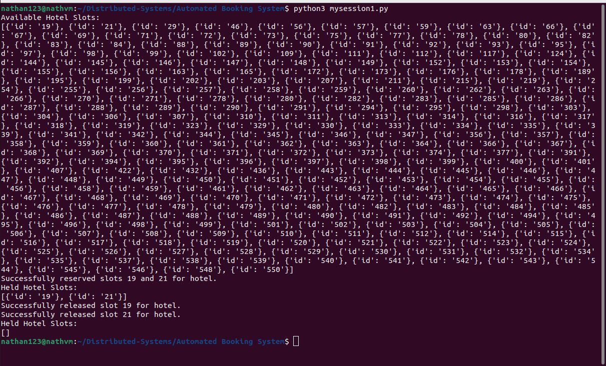

# Distributed-Systems

This project involves creating a Python client to interact with hotel and band reservation systems. The client performs basic operations like checking and reserving slots, cancelling reservations, finding free slots, and checking slots reserved by the user. Additionally, the client implements a strategy to reserve identical slots in both systems while handling concurrency and message delays.
# MySession 1: Basic Operations

1. Checking and Reserving a Slot

    The client sends a reservation request to the hotel system.
    Utilises the ReservationApi to send a POST request with slot details.

2. Cancelling a Reservation

    The client sends a DELETE request to cancel an existing reservation.
    The request includes the slot number and user ID.

3. Finding Free Slots

    The client sends a GET request to fetch available free slots.
    Parses and displays the list of free slots.

4. Checking Slots Reserved by You

    The client sends a GET request to fetch slots reserved by the user.
    Displays the reserved slots for the user.

 # MySession 2: Reserving Identical Slots

Objective:
Implement a strategy to reserve the same numbered slot for both the hotel and the band, ensuring concurrency handling and message delays.

Steps:

    Check for Availability:
        The client checks for available slots in both the hotel and band systems, focusing on the first 20 slots.

    Book the Earliest Common Slot:
        The client books the earliest available common slot in both systems.

    Release Other Booked Slots:
        If a slot is reserved, the client releases other less optimal booked slots.

    Recheck for Better Bookings:
        The client periodically checks for better available slots and updates the reservation if a better slot is found.

    Display Appropriate Messages:
        The client provides feedback messages to the user regarding the status of their reservations.

    Ensure Delay Between Requests:
        A delay of at least 1 second is enforced between successive requests to prevent denial of service attacks.
   

   
   
        

# Usage Instructions

Prerequisites:

    Python 3.x
    requests library (pip install requests)
# Running the Code:

    To run the first part of the exercise (Session 1), navigate to the directory containing mysession1.py and execute the following command in the terminal:

python3 mysession1.py

To run the second part of the exercise (Session 2), navigate to the directory containing mysession2.py and execute the following command in the terminal:

python3 mysession2.py
